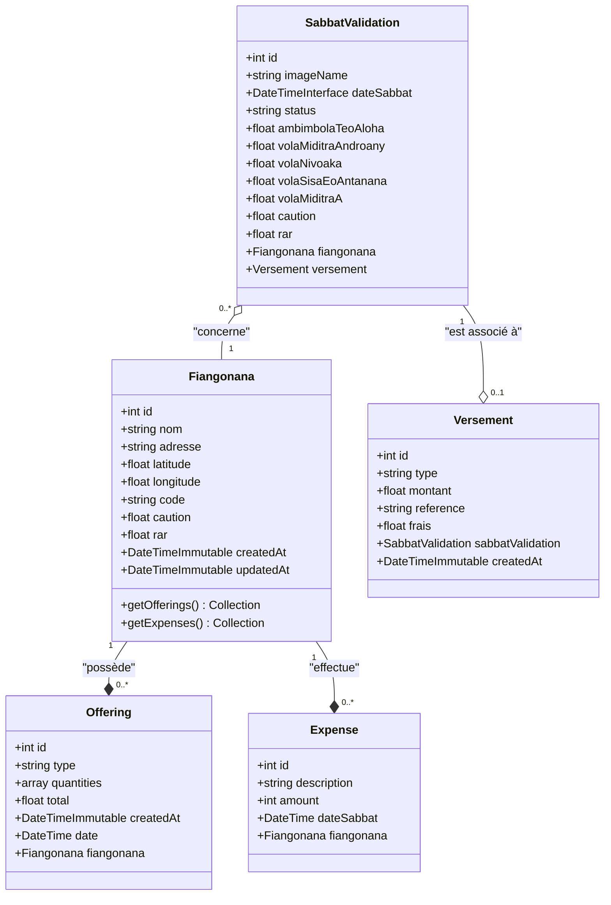
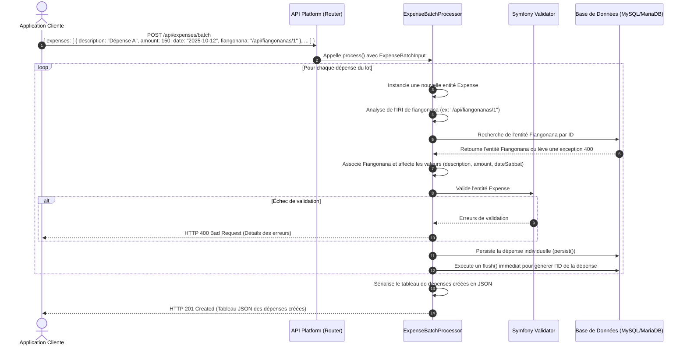

# Documentation d'Architecture Technique - Gestion Financière Paroissiale (Fiangonana)

Ce document décrit l'architecture technique, le modèle de données, les flux applicatifs et les choix de conception du système d'API de gestion financière pour les églises locales (paroisses).

---

## 1. Contexte Métier & Vocabulaire

Le système permet de centraliser et de valider les flux financiers hebdomadaires (Sabbats) d'un ensemble de paroisses.

### Glossaire des termes techniques & métiers (Malagasy / Français)
*   **Fiangonana** : Église locale / Paroisse. C'est l'entité centrale qui génère les transactions et à laquelle toutes les données financières sont rattachées.
*   **Sabbat** : Journée de célébration hebdomadaire (le samedi) durant laquelle les offrandes sont collectées, les dépenses de la semaine sont déclarées et le bilan financier est validé.
*   **Bordereau (Image)** : Preuve papier ou reçu de versement bancaire/mobile money, téléversé sous forme d'image encodée en Base64 par l'église locale.
*   **Ambimbola teo aloha** : Solde ou encaisse restante de la période précédente (Sabbat précédent).
*   **Vola miditra androany** : Total des fonds collectés durant la journée (entrées du jour).
*   **Vola nivoaka** : Total des dépenses ou sorties de fonds effectuées durant la journée.
*   **Vola sisa eo an-tanana** : Encaisse restante physique ou solde actuel conservé à la paroisse.
*   **Vola miditra A** : Autres revenus ou entrées exceptionnelles de catégorie A.
*   **Caution** : Dépôt de garantie ou fonds de réserve de la paroisse.
*   **RAR (Reste À Recouvrer)** : Sommes dues ou restes à recouvrer.
*   **Versement** : Opération de transfert physique ou numérique de l'encaisse vers le compte central (via espèces `CASH` ou transfert mobile `MOBILE_MONEY`).

---

## 2. Diagramme de Classes UML (Mermaid)

Le diagramme suivant illustre la structure des entités Doctrine ORM, leurs propriétés principales ainsi que leurs relations et cardinalités.



---

## 3. Flux Applicatifs & Séquences (Mermaid)

### A. Processus de Validation de Sabbat (Création avec Bordereau Base64)

Ce flux décrit comment une paroisse soumet ses comptes du Sabbat. L'image du bordereau (reçu) est envoyée sous format Base64 au serveur API. Le processeur `SabbatValidationProcessor` décode l'image, la stocke physiquement sur le disque et associe le chemin relatif à l'entité avant persistance.

```mermaid
sequenceDiagram
    autonumber
    actor Client as Application Cliente
    participant API as API Platform (Router)
    participant Processor as SabbatValidationProcessor
    participant FS as Système de Fichiers (Disque)
    participant DB as Base de Données (MySQL/MariaDB)

    Client->>API: POST /api/sabbat-validations <br/> { imageName: "data:image/png;base64,...", fiangonana: "/api/fiangonanas/1", ... }
    API->>Processor: Appelle process() avec l'entité SabbatValidation
    Note over Processor: Détection du format Base64 dans imageName
    Processor->>Processor: Décodage binaire de l'image & extraction de l'extension
    Processor->>FS: Crée le dossier s'il n'existe pas : /public/uploads/{fiangonanaId}/bordereau/
    Processor->>FS: Écrit le fichier binaire (ex: BRD_64f12ab3.png)
    Processor->>Processor: Remplace imageName par le chemin relatif :<br/> "/{fiangonanaId}/bordereau/BRD_xxxx.png"
    Processor->>Processor: Définit le status par défaut à "PENDING"
    Processor->>DB: Persiste et insère la ligne SabbatValidation
    DB-->>Processor: Confirmation de sauvegarde
    Processor-->>API: Retourne l'entité mise à jour
    API-->>Client: HTTP 201 Created <br/> { id: 42, status: "PENDING", imageName: "/1/bordereau/BRD_xxxx.png", ... }
```

### B. Enregistrement des Dépenses par Lot (Batch Expense Creation)

Le système propose un endpoint d'optimisation pour enregistrer plusieurs dépenses simultanément au lieu d'effectuer plusieurs requêtes HTTP distinctes. C'est le rôle de `ExpenseBatchProcessor`.



---

## 4. Organisation du Code & Choix de Conception

L'application respecte les conventions modernes de Symfony 7 et d'API Platform 4. Elle s'organise autour des couches suivantes :

### A. Les Entités (src/Entity)
Elles portent les métadonnées de mapping Doctrine et les annotations/attributs d'API Platform :
*   `Fiangonana` : Gère le cycle de vie de ses horodatages (`createdAt`, `updatedAt`) via des écouteurs de cycle de vie (`HasLifecycleCallbacks`, `PrePersist`, `PreUpdate`).
*   `Offering` : Possède des filtres de recherche intégrés (`SearchFilter` sur la relation fiangonana et `DateFilter` sur la date de l'offrande).
*   `Expense` : Dispose de filtres de recherche par date (`dateSabbat`) et par paroisse (`fiangonana`).
*   `SabbatValidation` : Utilise un filtre d'existence (`ExistsFilter`) sur sa relation `versement` pour savoir si un versement a déjà été effectué pour cette validation.
*   `Versement` : Entité liée par une relation un-à-un (`OneToOne`) unidirectionnelle à `SabbatValidation`.

### B. Les Objets de Transfert de Données (src/Dto)
Ces classes légères structurent les entrées/sorties pour les opérations personnalisées :
*   `ExpenseBatchInput` et `ExpenseBatchOutput` : Encapsulent les données d'écriture et de lecture pour le traitement par lot des dépenses.
*   `ExpenseTotalByFiangonana` et `OfferingTotalByFiangonana` : Servent de conteneurs pour restituer les agrégations calculées par les requêtes personnalisées.
*   `OfferingStatistics` : Structure d'exposition pour le endpoint `/api/offering_statistics`.

### C. State Processors (src/State)
Utilisés pour intercepter l'écriture des données et exécuter de la logique métier complexe :
*   `SabbatValidationProcessor` : Prise en charge du décodage de l'image en Base64 et stockage physique du fichier.
*   `ExpenseBatchProcessor` : Prise en charge à la fois de la création unitaire d'une dépense et de la création de lot (batch) de dépenses en résolvant les IRIs de relation.

### D. State Providers (src/State)
Utilisés pour personnaliser la récupération de données :
*   `OfferingStatisticsProvider` : Exécute une requête SQL brute (`executeQuery()`) optimisée avec agrégation `SUM` et groupement par église et date, puis produit un itérateur de DTOs `OfferingStatistics`.
*   `ExpenseStatisticsProvider` : Exécute une logique similaire. *(Note aux contributeurs : actuellement, ce provider exécute la même requête sur la table des offrandes au lieu de celle des dépenses. C'est un point d'amélioration identifié dans la roadmap technique)*.

### E. Contrôleurs Personnalisés (src/Controller)
*   `ExpenseTotalByFiangonanaController` : Traite la requête de calcul des dépenses cumulées par église.
*   `OfferingTotalByFiangonanaController` : Traite la requête de calcul des offrandes cumulées par église, avec support de filtre par identifiant d'église (`?fiangonana_id=X`).

### F. Filtres Personnalisés (src/Filter)
*   `FiangonanaSearchFilter` : Implémente un filtre pour rechercher une paroisse par son `code` exact.
*   `MultiFiangonanaFilter` : Permet de filtrer des collections en transmettant un tableau d'IRIs de paroisses (`?fiangonana[]=...`). Extrait dynamiquement les IDs numériques grâce à l'usage de `basename()`.
