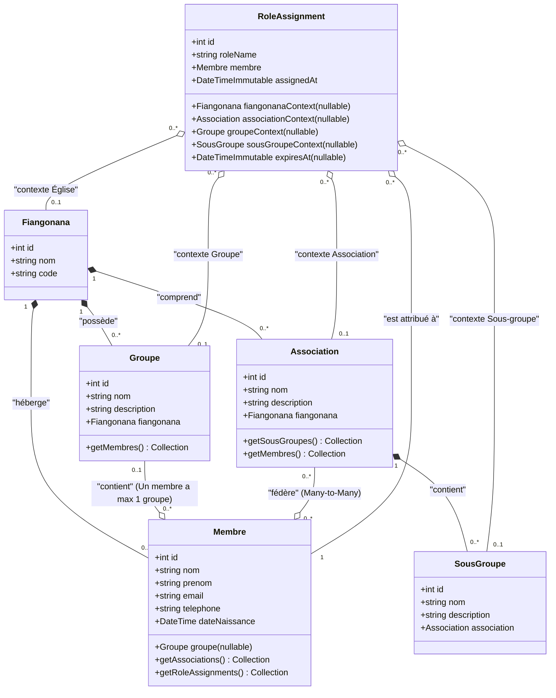
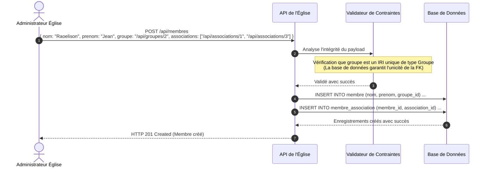
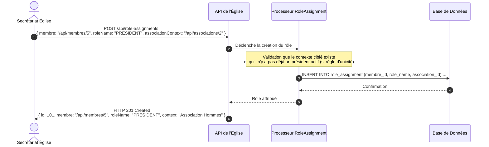

# Spécifications d'Organisation Paroissiale - Membres, Groupes, Associations & Rôles

Ce document détaille la conception technique et fonctionnelle permettant de modéliser la structure organisationnelle d'une paroisse, incluant la gestion des membres, des groupes internes, des associations, des sous-groupes ainsi que la gestion hautement dynamique des rôles et des mandats.

---

## 1. Description du Modèle & Contraintes Métier

L'église fonctionne comme une organisation multi-paliers avec les règles strictes suivantes :

1.  **L'Église (Fiangonana)** : L'entité globale qui chapeaute l'ensemble.
2.  **Membres** : Personnes physiques inscrites à l'église.
3.  **Groupes** : Structures spirituelles ou de service (ex: Chorale, Diaconat, École du Sabbat).
    *   *Contrainte* : **Un membre ne peut appartenir qu'à un seul groupe à la fois** (ou aucun).
4.  **Associations** : Mouvements sectoriels majeurs de l'église (ex: Association des Jeunes, Association des Hommes, Association des Femmes). De nouvelles associations pourront être créées dans le futur.
    *   *Contrainte* : **Un membre peut faire partie de plusieurs associations simultanément** (ou aucune).
5.  **Sous-groupes** : Cellules de travail ou sous-divisions internes rattachées exclusivement à une association parente (ex: Comité des Jeunes Adultes, Cellule Jeunes de Behoririka Nord).
6.  **Attribution des Rôles (RoleAssignment)** :
    *   Les membres peuvent se voir attribuer des rôles de direction ou de responsabilité à différents niveaux de contexte :
        *   **Niveau Église** (ex: *Président de l'église*)
        *   **Niveau Association** (ex: *Président de l'Association des Jeunes*, *Trésorier de l'Association des Femmes*)
        *   **Niveau Groupe** (ex: *Vice-président de la Chorale*)
        *   **Niveau Sous-groupe** (ex: *Secrétaire du Comité Jeunes de Behoririka Nord*)
    *   Un même membre peut cumuler plusieurs rôles distincts dans des contextes différents.

---

## 2. Diagramme de Classes UML (Mermaid)

Le diagramme suivant montre la conception de données proposée. Nous utilisons l'entité de liaison `RoleAssignment` avec des clés étrangères optionnelles vers chaque contexte d'application. Ce pattern, appelé **Polymorphic Context Assignment**, évite le partitionnement complexe de tables tout en assurant l'intégrité référentielle en base de données.



---

## 3. Flux & Processus Clés (Mermaid)

### A. Flux d'inscription d'un membre et validation des règles de groupe

Lorsqu'un membre est créé ou mis à jour, l'API valide les cardinalités : le groupe est associé via une relation standard de type clé étrangère directe, garantissant de façon native en base de données qu'un membre ne possède **jamais plus d'un groupe**.



### B. Flux d'attribution de Rôles Multiples (Contextuels)

Ce diagramme montre comment un membre obtient ses rôles de direction. L'API reçoit l'identifiant du membre, le nom du rôle (`PRESIDENT`, `TRESORIER`, etc.) et spécifie l'identifiant du contexte ciblé.



---

## 4. Exemples de Payloads JSON pour l'API

### A. Création d'un Membre
*   **POST** `/api/membres`
*   **Description** : Crée un membre relié à au plus un groupe et à plusieurs associations.
*   **Données** :
```json
{
  "nom": "Rakotomalala",
  "prenom": "Tahina",
  "email": "tahina@example.com",
  "telephone": "+261340000000",
  "dateNaissance": "1995-04-18T00:00:00Z",
  "groupe": "/api/groupes/1",
  "associations": [
    "/api/associations/1",
    "/api/associations/2"
  ]
}
```

### B. Attribution d'un Rôle au niveau Église (Président de l'Église)
*   **POST** `/api/role-assignments`
*   **Données** :
```json
{
  "membre": "/api/membres/12",
  "roleName": "PRESIDENT",
  "fiangonanaContext": "/api/fiangonanas/1"
}
```

### C. Attribution d'un Rôle au niveau Association (Trésorier de l'Association des Jeunes)
*   **POST** `/api/role-assignments`
*   **Données** :
```json
{
  "membre": "/api/membres/12",
  "roleName": "TRESORIER",
  "associationContext": "/api/associations/1"
}
```

### D. Attribution d'un Rôle au niveau Sous-groupe
*   **POST** `/api/role-assignments`
*   **Données** :
```json
{
  "membre": "/api/membres/12",
  "roleName": "SECRETAIRE",
  "sousGroupeContext": "/api/sous-groupes/4"
}
```
